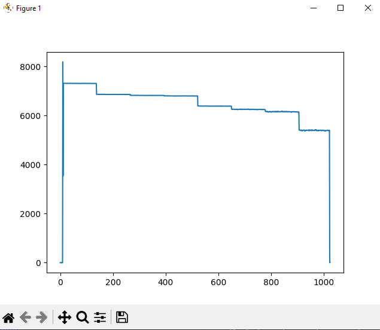

# Python script for Stresing cameras

In this repository you can find a python script [camera.py](https://github.com/Entwicklungsburo-Stresing/stresing_python/blob/master/camera.py) for operating [Stresing](https://stresing.de) cameras. This script is only an example to show you, how to use our library with python and do a very basic measurement operations.

## Dependencies
* [Python 3](https://www.python.org/)
* [Microsoft Visual C++ Redistributable](https://aka.ms/vs/16/release/vc_redist.x64.exe) to use the DLL
* [ctypes](https://pypi.org/project/ctypes/)
* [matplotlib](https://pypi.org/project/matplotlib/)

## DLL source
The source code of the DLL ESLSCDLL.dll can be found in the repository [EBST_CAM](https://github.com/Entwicklungsburo-Stresing/EBST_CAM).

## Documentation
The script is following the basic operation as described in the chapter *How to operate Stresing cameras* of the [software documentation](https://entwicklungsburo-stresing.github.io/). The settings must match your camera system. You can find a description of every setting [here](https://entwicklungsburo-stresing.github.io/structmeasurement__settings.html).
