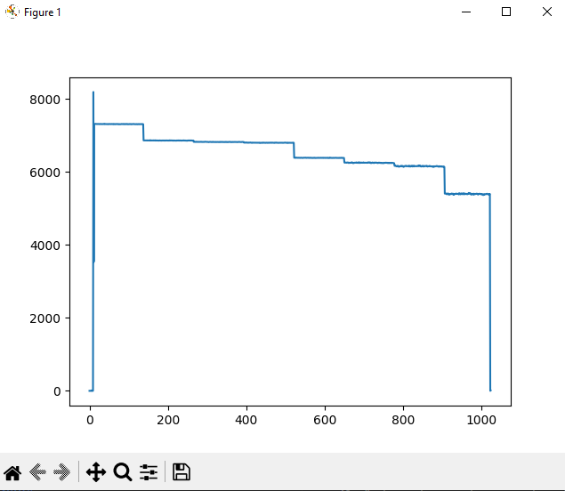

# Python script for Stresing cameras
In this repository you can find the python module *stresing* for operating [Stresing](https://stresing.de) cameras. This is located in the folder `stresing/`. You can find examples how to use this module in the folder `example/`. If you don't know where to start, start with [examples/simple_blocking_measurement.py](examples/simple_blocking_measurement.py).



## Dependencies

### Windows
* [Python 3](https://www.python.org/)
* [Microsoft Visual C++ Redistributable](https://aka.ms/vs/16/release/vc_redist.x64.exe)
* [ctypes](https://pypi.org/project/ctypes/)
* [configparser](https://pypi.org/project/configparser/)

### Linux
* [Python 3](https://www.python.org/)
* [ctypes](https://pypi.org/project/ctypes/)
* [configparser](https://pypi.org/project/configparser/)
* Linux kernel driver from [EBST_CAM](https://github.com/Entwicklungsburo-Stresing/EBST_CAM) (must be installed separately, see below)

## Library source
The source code of the library (ESLSCDLL.dll on Windows, libESLSCDLL.so on Linux) can be found in the repository [EBST_CAM](https://github.com/Entwicklungsburo-Stresing/EBST_CAM).

## Linux kernel driver
On Linux, the kernel driver must be installed before using this package. Install it via the `.deb` package from the [EBST_CAM releases](https://github.com/Entwicklungsburo-Stresing/EBST_CAM/releases):
```bash
sudo apt install ./escam_x.xx.x.deb
```
Or compile and install it manually:
```bash
cd linux-driver/kernelspace/
make
sudo insmod .ko
```

## Documentation
There is a [full documentation](https://entwicklungsburo-stresing.github.io) of the library ESLSCDLL. The settings in `config.ini` must match your camera system. You can find a description of every setting [here](https://entwicklungsburo-stresing.github.io/structmeasurement__settings.html). The file config.ini is compatible with the exported settings of the GUI [Escam](https://github.com/Entwicklungsburo-Stresing/EBST_CAM). Settings that are not found in the file, will be left as default.

## Examples
You can run examples with
```
python -m examples.simple_blocking_measurement
```

## Installing as module
You can install the module stresing with
```
pip install stresing
```

For development, clone the repository and install with
```
pip install -e .[dev]
```

## License
The python module *stresing* is licened under the LGPL-3. All examples in the folder `examples/` are published as public domain under the Unlicense.
